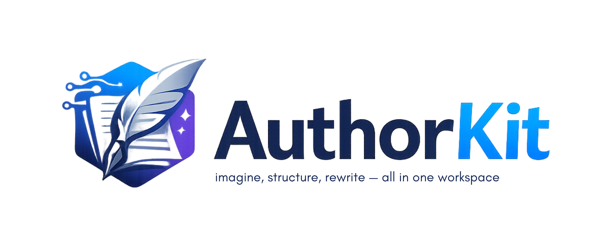

  

**AuthorKit** evolves the ideas of [**Writingway**](https://github.com/aomukai/Writingway) (creative writing assistant) into a **decoupled** stack: a standalone **HTTP API** ([`api/`](api/README.md)) and a **Visual Studio Code extension** ([`plugin/`](plugin/README.md)). The user opens a **novel project folder** in VS Code; the API reads and writes project files under **`.authorkit/`** inside that workspace (and keeps workshop chat history in a **SQLite** database there).

## Authors

- **Julien Moulin** — [julien@supralab.fr](mailto:julien@supralab.fr)

Upstream **Writingway** is © aomukai (MIT). See **`LICENSE`**.

## What it does

### API ([`api/`](api/README.md))

- **FastAPI** service: **`/v1/...`**, **`/health`**, **`/ready`**, OpenAPI at **`/docs`**.
- **Project on disk** (per `workspace_root`): **structure** (acts → chapters → scenes), **compendium** JSON, **scene** Markdown (`.authorkit/scenes/<uuid>.md`), optional **per-entry** Markdown for compendium rows that have an **`id`** (`.authorkit/<category-slug>/<id>.md`), **prompts** / **project settings** JSON.
- **Workshop:** augmented chat with optional **scene** and **compendium** context, **`use_rag`**, streaming (**SSE**). LLM calls go through a **multi-provider** stack (profiles in settings).
- **Workshop threads:** when `thread_id` is sent, the API loads history from **SQLite** (`.authorkit/workshop/workshop.db`), appends turns, stores **structured context** on user messages (`scene_uuids`, `compendium_excerpts`), maintains a **rolling summary** when the thread grows past a hot window, and writes small **JSON** anchors under `.authorkit/workshop/threads/<id>.json`. See the [**API README**](api/README.md) (persistence, endpoints).
- **Global app settings:** `GET/PUT /v1/app/settings` → file on the API host (default **`~/.authorkit/settings.json`**): LLM profiles, keys, timeouts.
- **Other:** raw **`/v1/chat`** (sync + stream), **prompt preview** / **prose generate**, **RAG** index/query, **conversation summarize**.

### VS Code extension ([`plugin/`](plugin/README.md))

- **Trees:** **Book Structure**, **Characters**, **World** — structure and compendium editing through the API.
- **Workshop** view: **thread** list (create / rename / delete / switch), **context chips** (scenes + compendium), **streaming** assistant replies, **persisted tags** on user messages after reload, **insert the assistant reply** into a scene or compendium sheet (**at end** or **at cursor**).
- **Chat:** optional **`@authorKit`** participant (same workshop pipeline); the **Workshop** panel is the main UI.
- **LLM Settings** webview, **status bar** API indicator, **Initialize Workspace**, commands listed in the [**extension README**](plugin/README.md).

## Data layout (high level)

| Location | Role |
|----------|------|
| **`.authorkit/`** in the novel workspace | Structure, compendium, scenes, prompts, RAG dir, **workshop** SQLite + thread JSON |
| **`~/.authorkit/settings.json`** (API host) | Global LLM profiles and app settings (used by the extension’s LLM panel) |

## Repository layout

| Folder | Purpose |
|--------|---------|
| [`api/`](api/README.md) | AuthorKit **HTTP service** (Python). |
| [`plugin/`](plugin/README.md) | **VS Code extension** (TypeScript). |
| [`source/`](source/) | *(Optional)* Legacy Writingway **PyQt** app—not required for AuthorKit. |
| [`.github/workflows/`](.github/workflows/) | **CI** (tests, Ruff, extension compile) and **tagged releases** (standalone API zips + VSIX). |

## Quick start

### Using GitHub Releases (no clone)

Each **[release](https://github.com/SupraLab/authorkit/releases)** for a tag `v*` (e.g. `v0.1.0`) ships **pre-built assets**: the VS Code extension as **`author-kit-<semver>.vsix`** and one **API zip per OS** — `author-kit-api-<semver>-<platform>.zip` (`linux-x64`, `win-amd64`, `darwin-arm64`, `darwin-x64`). The semver in the filenames comes from **`plugin/package.json`** (VSIX) and the API build (**[`api/pyproject.toml`](api/pyproject.toml)**); keep them aligned with the tag for a consistent stack.

1. **Install the extension:** download **`author-kit-<semver>.vsix`** from that release. In VS Code: **Extensions** → **⋯** → **Install from VSIX…**, choose the file, reload if prompted.
2. **Run the API** — pick one:
   - **Extension-managed (simplest):** in settings, enable **Start local API**. On first use the extension downloads the matching **`author-kit-api-<semver>-<platform>.zip`** from the **same** release, caches it, and runs the binary on `127.0.0.1` (port configurable). Details: [**plugin/README.md**](plugin/README.md) (**Local API bundle**, **Re-download AuthorKit API bundle**).
   - **Manual:** extract the zip for your platform, run the `author-kit-api` executable (or use `uvicorn` / `python -m author_kit` from [**api/README.md**](api/README.md)). Turn **Start local API** off and set **API base URL** (default `http://127.0.0.1:8765`).
3. **File → Open Folder** on your novel project (single-root workspace), run **Initialize Workspace** once, then use the AuthorKit views.

### Developing from this repository

1. **Extension:** [**plugin/README.md**](plugin/README.md) — `npm install`, `npm run compile`, **Run → Start Debugging** (F5), or build a `.vsix` locally with `vsce package`.
2. **API:** as in [**api/README.md**](api/README.md) — venv, `pip install -e ".[dev]"`, `uvicorn …`, or a local PyInstaller build via `api/scripts/build-standalone.sh`.
3. Same workspace step as above: open a folder, **Initialize Workspace**, then use the views.

## Releases and CI

- **Quality CI** ([`.github/workflows/ci.yml`](.github/workflows/ci.yml)): on pushes and pull requests to `main` / `master`, runs **pytest** and **Ruff** on the API (Python 3.10 and 3.12) and on the extension **`npm run lint`** (ESLint), **`npm run test`** (Vitest), and **`npm run compile`**.
- **Release (API + VSIX)** ([`.github/workflows/release-api-binaries.yml`](.github/workflows/release-api-binaries.yml)): on a version tag `v*` (e.g. `v0.1.0`), builds **PyInstaller** bundles per OS with [`api/scripts/build-standalone.sh`](api/scripts/build-standalone.sh), packages the extension with **`@vscode/vsce`**, and attaches to the GitHub Release:
  - **`author-kit-api-<semver>-<platform>.zip`** for each supported platform;
  - **`author-kit-<semver>.vsix`** (name and version from **`plugin/package.json`**).
  The extension’s **`bundledApiVersion`** (in `plugin/package.json`) should match the API semver you expect users to download for that release.

## License

- **Root** and **`api/`**: **MIT** — see **`LICENSE`** in each place. Retains **Writingway** © aomukai and **AuthorKit** (API / stack) © Julien Moulin.
- **`plugin/`** (VS Code extension): **MIT** — see **`plugin/LICENSE`**. Copyright **Julien Moulin** only (extension code is not derived from the legacy Writingway desktop app).
